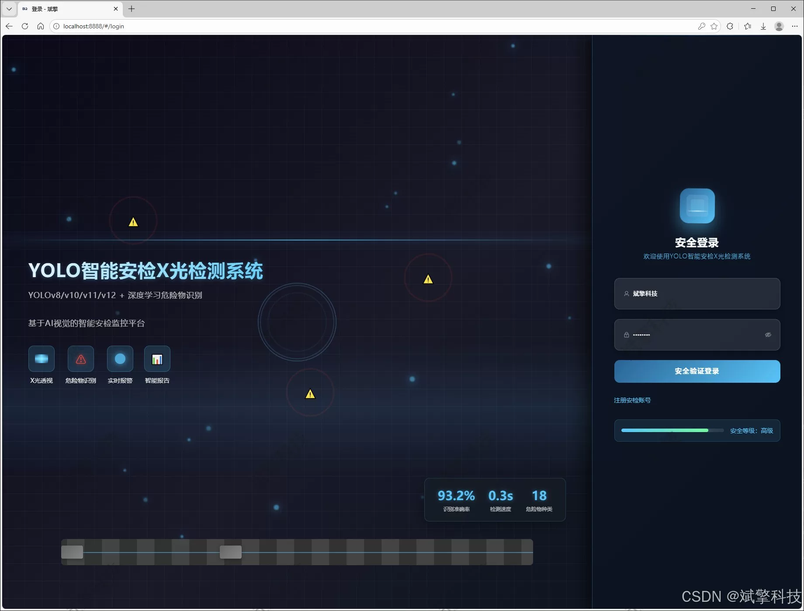
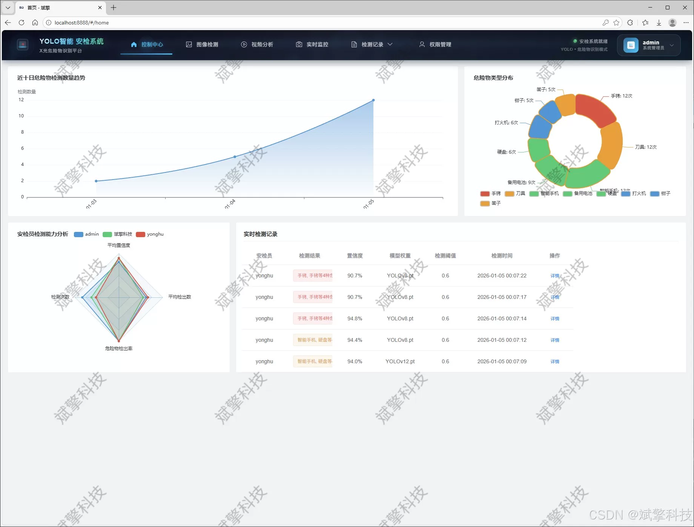
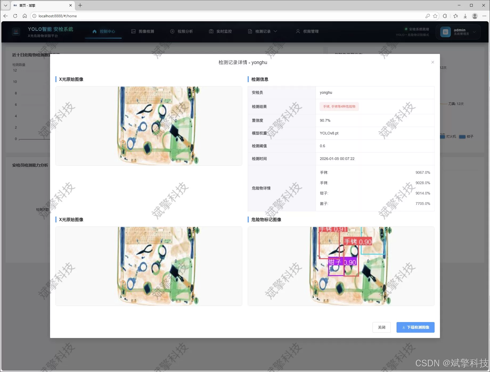
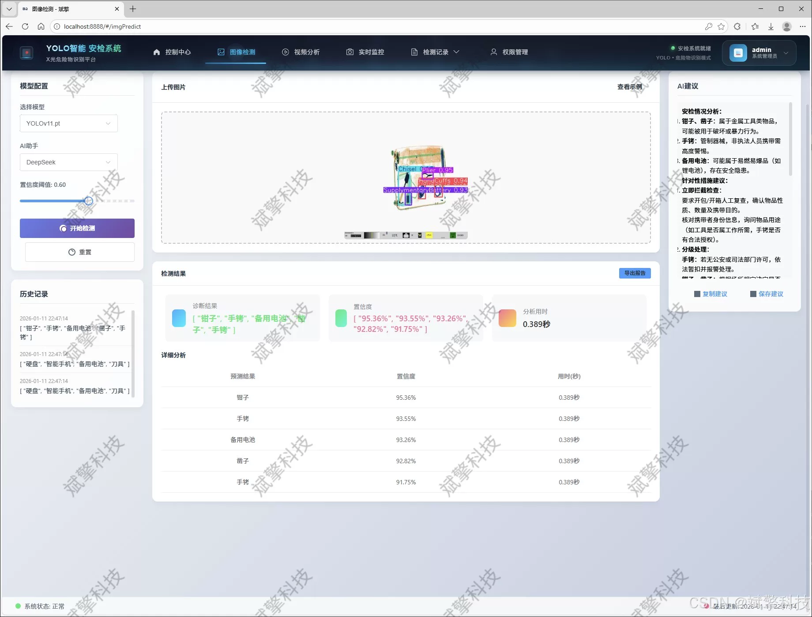
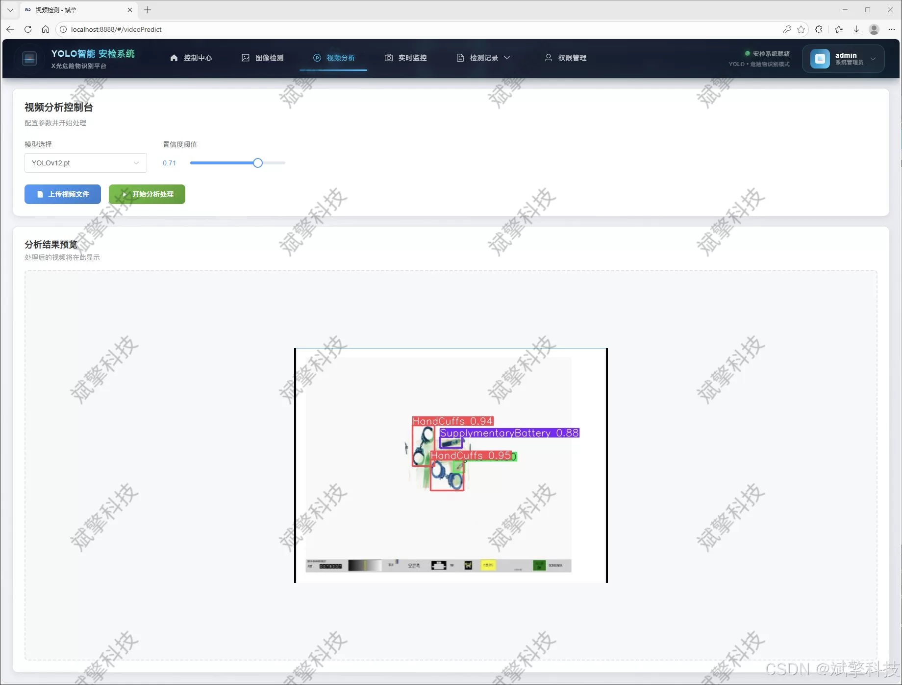
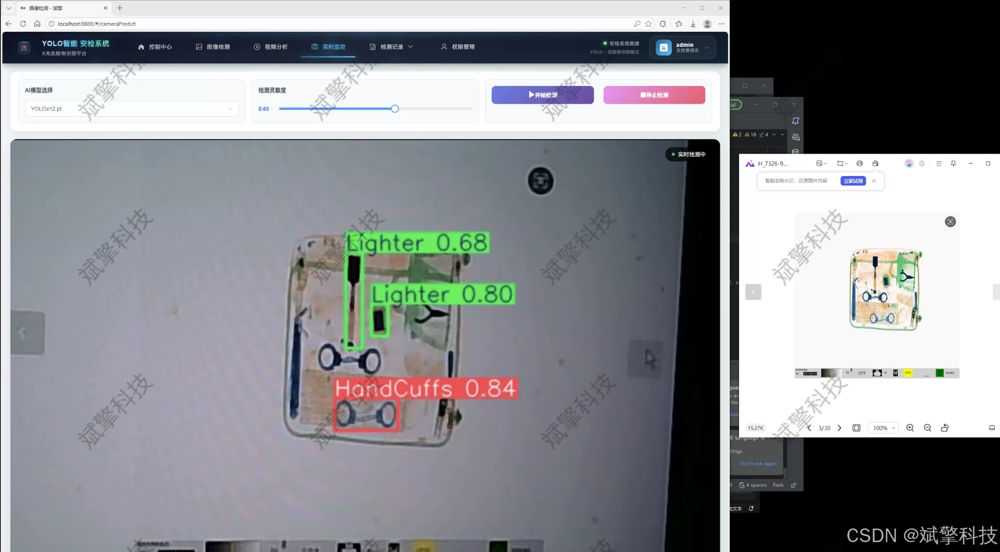
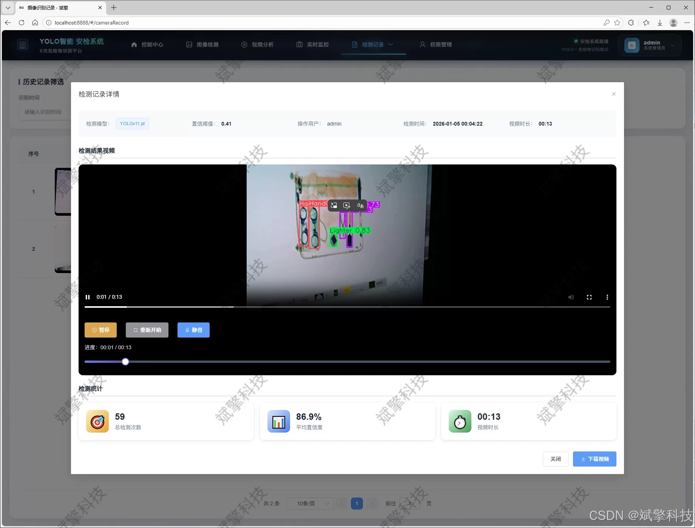
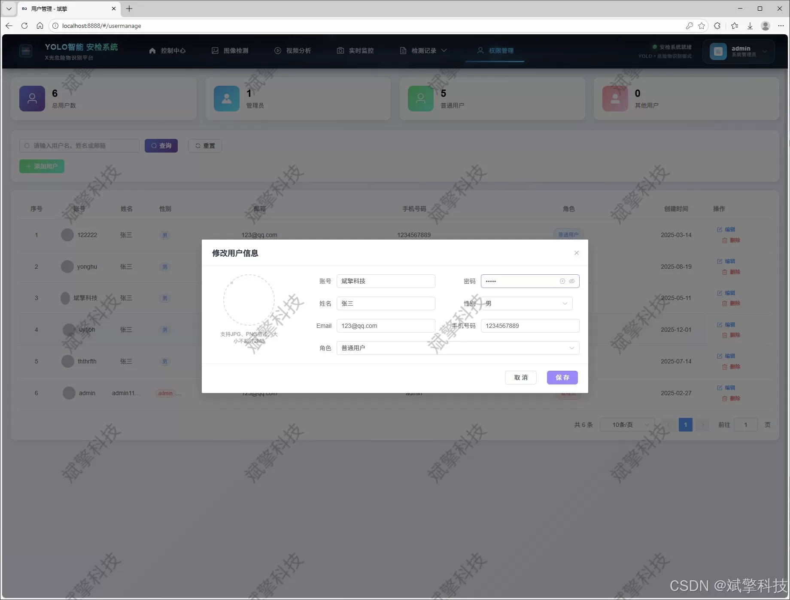
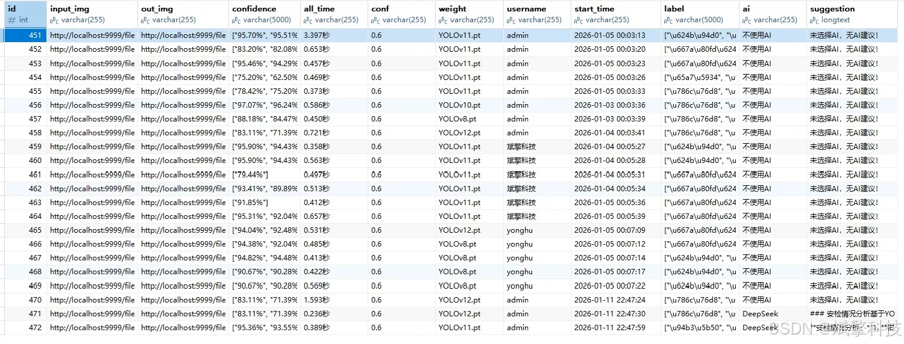

# YOLO+Large Model Security Inspection and Recognition System

## Body

The YOLO+ large model security inspection recognition system is based on the YOLO deep learning and the big models of Qianwen and DeepSeek. The security x-ray hazards recognition detection system (DeepSeek intelligent analysis + web interaction interface + front-end separation + YOLO data + YOLOv8/YOLOv10/YOLOv11/YOLOv12)

This project has designed and implemented a smart X-ray inspection system for dangerous substance detection based on deep learning and Web technology. The system is centered around the current mainstream YOLOv8, YOLOv10, YOLOv11, and YOLOv12 series of advanced object detection algorithms, constructing an efficient and precise automatic recognition engine for dangerous items. The system's backend uses the SpringBoot framework, while the frontend employs modern Web technologies, achieving a separation between the backend and frontend to ensure maintainability, scalability, and good user experience.

The system dataset is tailored for security inspection scenarios, comprising 18 common hazardous and prohibited items (such as Guns, Knives, Firecrackers, Lighters, SmartPhones, etc.). The training set consists of 4385 images, while the validation set includes 1880 images, providing a solid data foundation for the model's robustness. The system not only offers basic image, video, and real-time camera stream detection functions but also innovatively integrates the intelligent analysis module of the DeepSeek large language model. This enables contextual understanding and generative description of detection results, enhancing the level of intelligence of the system.

In terms of application, the system has a complete user authentication and management system, including user registration and login, personal information management, and administrators' centralized management of users and all inspection records. All inspection operation records are persistently stored in MySQL databases, providing intuitive data support for security management decisions. This system combines cutting-edge deep learning algorithms with mature industrial-grade Web development frameworks to provide a comprehensive, interactive, and reliable software solution for security inspection scenarios such as airports, subways, stations, etc.

Functional module

✅ User Login and Registration: Supports password detection, saves to MySQL database.

✅ Supports four YOLO model switches, YOLOv8, YOLOv10, YOLOv11, YOLOv12.

✅ Information Visualization, Data Visualization.

✅ Image detection supports AI analysis functions, deepseek and Qianwen.

✅ Supports image detection, video detection, and real-time camera detection. The results are saved to a MySQL database.

✅ Picture recognition record management, video recognition record management and camera recognition record management.

✅ User Management Module, administrators can add, delete, modify, and query users.

✅ Personal center, can modify their own information, password name profile picture and so on.

There is no Lunwen writing service, nor any Lunwen.

## Images

## Payment

Here is a pay link on Stripe ( https://buy.stripe.com/3cs8yP7sY87d0vu9AB ). Please contact me lonlonago@foxmail.com after funding $89, and I will send you a complete data files , thank you!

